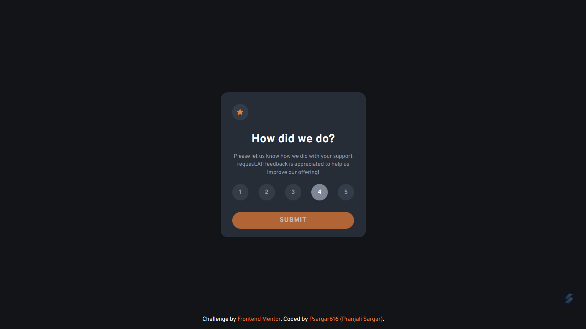
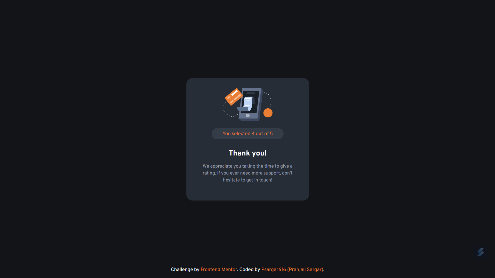

# Frontend Mentor - Interactive rating component solution using ReactJS

This is a solution to the [Interactive rating component challenge on Frontend Mentor](https://www.frontendmentor.io/challenges/interactive-rating-component-koxpeBUmI). Frontend Mentor challenges help you improve your coding skills by building realistic projects. 

## Table of contents

- [Overview](#overview)
  - [The challenge](#the-challenge)
  - [Screenshot](#screenshot)
  - [Links](#links)
  - [Built with](#built-with)
  - [What I learned](#what-i-learned)
  - [Continued development](#continued-development)
  - [Useful resources](#useful-resources)
  - [Author](#author)

### The challenge

Users should be able to:

- View the optimal layout for the app depending on their device's screen size
- See hover states for all interactive elements on the page
- Select and submit a number rating
- See the "Thank you" card state after submitting a rating

### Screenshot

### Links

- Solution URL: [ solution URL ](https://github.com/Psargar616/interactive-rating-component)
- Live Site URL: [ live site URL ](https://interactive-rating-soln-fm.netlify.app/)

### Built with

- Semantic HTML5 markup
- CSS custom properties
- Flexbox
- Mobile-first workflow
- [React](https://reactjs.org/) - JS library

### What I learned

- useState() hook
- React Basics
- React props

### Continued development

Use this project component can be used to build rating components in other projects

### Useful resources

- [ReactDev.org](https://legacy.reactjs.org/docs/create-a-new-react-app.html) - This helped me for concepts like how to use useState() hooks.

### Author

- Frontend Mentor - [@Psargar616](https://www.frontendmentor.io/profile/Psargar616)

